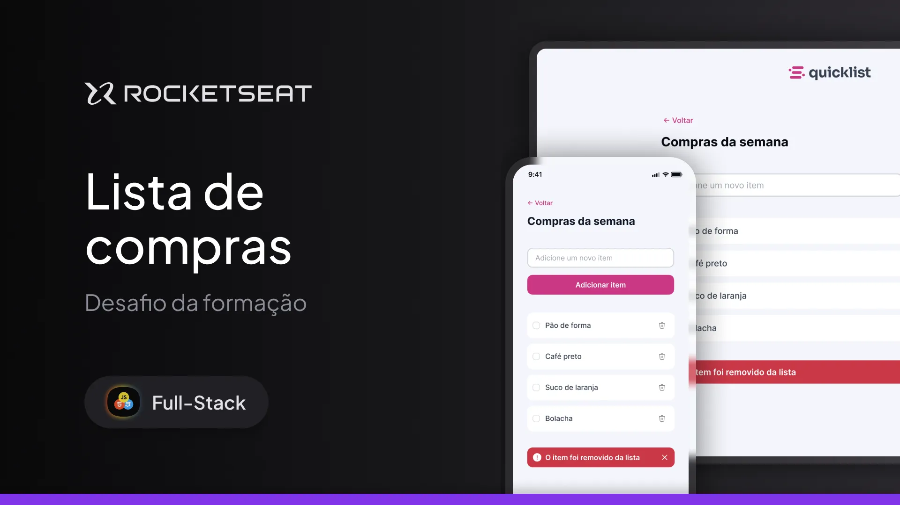

# 🛒 QuickList

Site responsivo de **lista de compras**, desenvolvido como parte de um desafio da **Rocketseat**.

Com o **QuickList**, o usuário pode adicionar e remover itens de forma simples, rápida e com feedback visual. Totalmente funcional para **dispositivos mobile** e desktop.

  

---

## 🔗 Acesse o projeto

- 💻 Deploy: [https://leyvison-menezes.github.io/Desafio-QuickList/](https://leyvison-menezes.github.io/Desafio-QuickList/)
- 📁 Repositório: [https://github.com/Leyvison-Menezes/Desafio-QuickList](https://github.com/Leyvison-Menezes/Desafio-QuickList)

---

## ✨ Funcionalidades

- ✅ Adicionar novos itens à lista  
- 🗑️ Remover itens individualmente  
- 📱 Layout responsivo (desktop-first)  
- 🔔 Feedback visual ao remover item

---

## 🧠 Aprendizados

Durante o desenvolvimento, aprofundei conhecimentos sobre:

- JavaScript moderno  
- Manipulação da DOM  
- Eventos e funções  
- Estruturação HTML semântica  
- Boas práticas em CSS responsivo

---

## 🛠 Tecnologias

- HTML5  
- CSS3  
- JavaScript (JS Vanilla)

---

## 🚀 Como rodar localmente

1. Clone o repositório  
2. Abra o arquivo `index.html` com seu navegador

---

## 📌 Status

✅ Projeto finalizado

---

## 🧑‍🏫 Desafio da formação

Proposto por [Rocketseat](https://www.rocketseat.com.br/) 🚀
